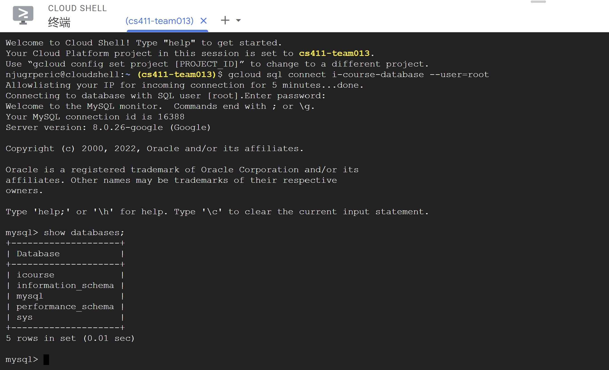
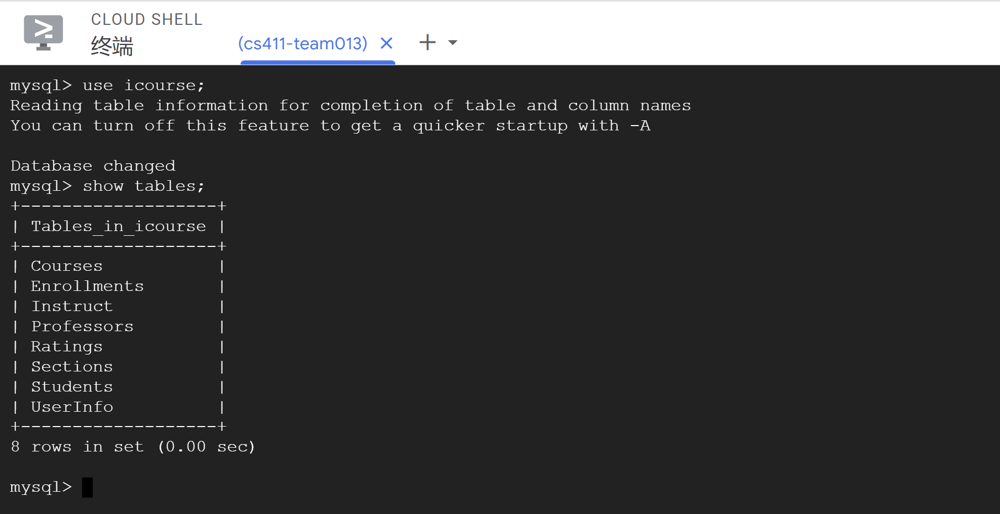
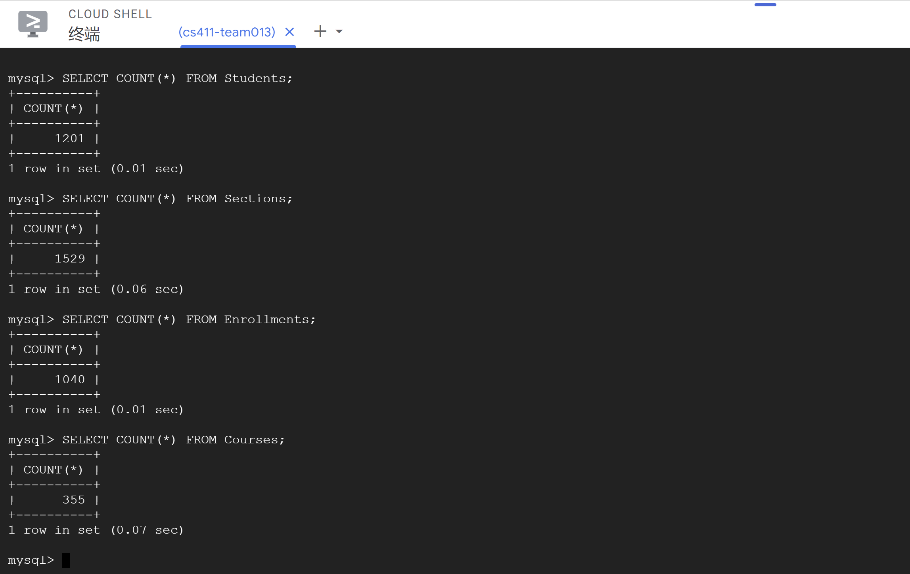

# Database Implementation and Indexing

## Database DDL Commands

```mysql
CREATE database icourse;

USE icourse;

#Database TABLE DDL Commands
#Entities

CREATE TABLE UserInfo(
    NetId VARCHAR(255),
    Password VARCHAR(255),
    UserType ENUM('Student', 'Professor'),
    PRIMARY KEY(NetId)
);

CREATE TABLE Students(
    NetId VARCHAR(255),
    Name VARCHAR(255),
    Department VARCHAR(255),
    Level ENUM('Grad', 'Undergrad'),
    PRIMARY KEY(NetId)
);

CREATE TABLE Professors(
    NetId VARCHAR(255),
    Name VARCHAR(255),
    Department VARCHAR(255),
    PRIMARY KEY(NetId)
);

CREATE TABLE Courses(
    CourseId VARCHAR(255),
    Department VARCHAR(255),
    Title VARCHAR(255),
    Description VARCHAR(5000),
    PRIMARY KEY(CourseId)
);

CREATE TABLE Sections(
    CRN int,
    LectureType VARCHAR(255),
    AvaliableCredits VARCHAR(255),
    Restrictions VARCHAR(255),
    LectureTime VARCHAR(255),
    Capacity int,
    Location VARCHAR(255),
    CourseId VARCHAR(255),
    PRIMARY KEY(CRN),
    FOREIGN KEY(CourseId) REFERENCES Courses(CourseId) ON DELETE CASCADE
);

#Relationships

CREATE TABLE Instruct(
    Professor VARCHAR(255),
    CRN int,
    PRIMARY KEY(Professor, CRN),
    FOREIGN KEY(Professor) REFERENCES Professors(NetId) ON DELETE CASCADE,
    FOREIGN KEY(CRN) REFERENCES Sections(CRN) ON DELETE CASCADE
);

CREATE TABLE Ratings(
    Student VARCHAR(255),
    Professor VARCHAR(255),
    Rate Real,
    Comment VARCHAR(5000),
    PRIMARY KEY(Student, Professor),
    FOREIGN KEY(Student) REFERENCES Students(NetId) ON DELETE CASCADE,
    FOREIGN KEY(Professor) REFERENCES Professors(NetId) ON DELETE CASCADE
);

CREATE TABLE Enrollments(
    CRN int,
    NetId VARCHAR(255),
    Semester VARCHAR(255),
    Credit int,
    Grade VARCHAR(255),
    PRIMARY KEY(NetId, CRN),
    FOREIGN KEY(CRN) REFERENCES Sections(CRN) ON DELETE CASCADE,
    FOREIGN KEY(NetId) REFERENCES Students(NetId) ON DELETE CASCADE
);
```

We implement `icourse` database on Google GCP. Connection to the database is shown as below.



We use `show tables` command to see tables implemented in the databse.



## Inserting Data

For this stage, we will focus on students' enrollments in different courses. We will use `Students`, `Sections`, `Courses`, and `Enrollments` and insert data into these four tables.

For `Courses` and `Sections`, we crawled data from [UIUC Course Explorer](https://courses.illinois.edu//) website to fetch all courses and sections from 5 departments `CS`, `ECE`, `ENG`, `FIN`, and `MATH`. For `Students`, we use auto-generated data representing students from 3 different departments `CS`, `ECE`, and `MATH`. However, for the `Name` attributes, we apply [Name Dataset](https://github.com/smashew/NameDatabases) and randomly choose firstnames and lastnames in the dataset and combine them as full names. For `Enrollments`, we generate data by combining information of `Sections` and `Students`. We also intentionally create data that are related to the result of Advanced SQL queries mentioned in the following chapters.

For table `Students`, `Sections`, and `Enrollments`, we insert over 1000 data tuples. Below is a proof of data volumes inserted into these tables.



## Advanced SQL Queries

For this stage, we develop two advanced SQL queries and analyze the performances by using different indexings.

### Query 1

Write a MySQL query to find all students in `CS` who take at least one course offered by `ECE`, and all students in `ECE` who take at least one course offered by `CS`. Return their `NetId`, `Name`, `Department`, and `Level`.

**The MySQL query is shown as follows:**

```mysql
# TODO: Complete MySQL query
```

**The result of this query is shown as follows:**

> **TODO**: Insert screenshots of the first 15 rows of results.

## Query 2

Write a MySQL query to find all students who take 8 credits or more courses, and never fail (Not `F` in `Grade`) in any of the course they take. Return their `NetId`, `Name`, and total credits `totalCredits`.

**The MySQL query is shown as follows:**


**The result of this query is shown as follows:**

> **TODO**: Insert screenshots of the first 15 rows of results.

## Indexing Analysis

> **TODO**: 
> 1. Use `EXPLAIN ANALYZE` to see query performance. **Save the screenshots or output of the commands**.
> 2. Add **3 different indexes** on the database, and re-analyze the performances. **Save the screenshots or output of the commands**.
> 3. Reason on why the performance change. Write down your analysis.
>
> You can use the same indexing for analyzing both queries. But Note that both analysis should cover details of the requirements.
