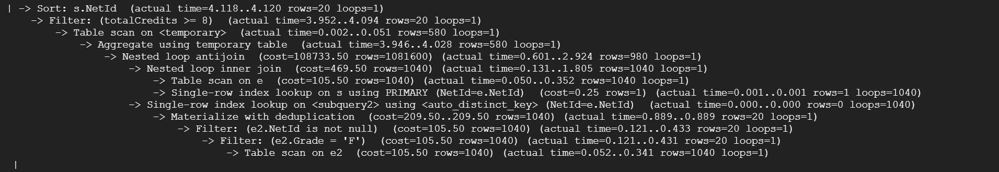
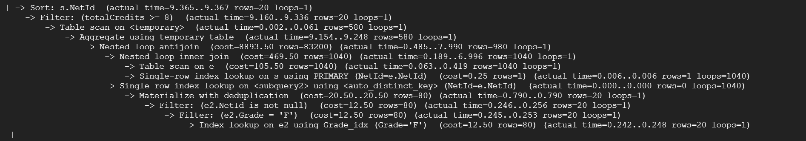
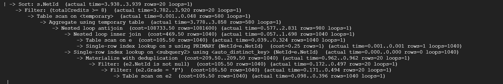

# Database Implementation and Indexing

## Database DDL Commands

```mysql
CREATE database icourse;

USE icourse;

#Database TABLE DDL Commands
#Entities

CREATE TABLE UserInfo(
    NetId VARCHAR(255),
    Password VARCHAR(255),
    UserType ENUM('Student', 'Professor'),
    PRIMARY KEY(NetId)
);

CREATE TABLE Students(
    NetId VARCHAR(255),
    Name VARCHAR(255),
    Department VARCHAR(255),
    Level ENUM('Grad', 'Undergrad'),
    PRIMARY KEY(NetId)
);

CREATE TABLE Professors(
    NetId VARCHAR(255),
    Name VARCHAR(255),
    Department VARCHAR(255),
    PRIMARY KEY(NetId)
);

CREATE TABLE Courses(
    CourseId VARCHAR(255),
    Department VARCHAR(255),
    Title VARCHAR(255),
    Description VARCHAR(5000),
    PRIMARY KEY(CourseId)
);

CREATE TABLE Sections(
    CRN int,
    LectureType VARCHAR(255),
    AvaliableCredits VARCHAR(255),
    Restrictions VARCHAR(255),
    LectureTime VARCHAR(255),
    Capacity int,
    Location VARCHAR(255),
    CourseId VARCHAR(255),
    PRIMARY KEY(CRN),
    FOREIGN KEY(CourseId) REFERENCES Courses(CourseId) ON DELETE CASCADE
);

#Relationships

CREATE TABLE Instruct(
    Professor VARCHAR(255),
    CRN int,
    PRIMARY KEY(Professor, CRN),
    FOREIGN KEY(Professor) REFERENCES Professors(NetId) ON DELETE CASCADE,
    FOREIGN KEY(CRN) REFERENCES Sections(CRN) ON DELETE CASCADE
);

CREATE TABLE Ratings(
    Student VARCHAR(255),
    Professor VARCHAR(255),
    Rate Real,
    Comment VARCHAR(5000),
    PRIMARY KEY(Student, Professor),
    FOREIGN KEY(Student) REFERENCES Students(NetId) ON DELETE CASCADE,
    FOREIGN KEY(Professor) REFERENCES Professors(NetId) ON DELETE CASCADE
);

CREATE TABLE Enrollments(
    CRN int,
    NetId VARCHAR(255),
    Semester VARCHAR(255),
    Credit int,
    Grade VARCHAR(255),
    PRIMARY KEY(NetId, CRN),
    FOREIGN KEY(CRN) REFERENCES Sections(CRN) ON DELETE CASCADE,
    FOREIGN KEY(NetId) REFERENCES Students(NetId) ON DELETE CASCADE
);
```

We implement `icourse` database on Google GCP. Connection to the database is shown as below.


We use `show tables` command to see tables implemented in the databse.


## Inserting Data

For this stage, we will focus on students' enrollments in different courses. We will use `Students`, `Sections`, `Courses`, and `Enrollments` and insert data into these four tables.

For `Courses` and `Sections`, we crawled data from [UIUC Course Explorer](https://courses.illinois.edu//) website to fetch all courses and sections from 5 departments `CS`, `ECE`, `ENG`, `FIN`, and `MATH`. For `Students`, we use auto-generated data representing students from 3 different departments `CS`, `ECE`, and `MATH`. However, for the `Name` attributes, we apply [Name Dataset](https://github.com/smashew/NameDatabases) and randomly choose firstnames and lastnames in the dataset and combine them as full names. For `Enrollments`, we generate data by combining information of `Sections` and `Students`. We also intentionally create data that are related to the result of Advanced SQL queries mentioned in the following chapters.

For table `Students`, `Sections`, and `Enrollments`, we insert over 1000 data tuples. Below is a proof of data volumes inserted into these tables.


## Advanced SQL Queries

For this stage, we develop two advanced SQL queries and analyze the performances by using different indexings.

### Query 1

Write a MySQL query to find all students in `CS` who take at least one course offered by `ECE`, and all students in `ECE` who take at least one course offered by `CS`. Return their `NetId`, `Name`, `Department`, and `Level`.

**The MySQL query is shown as follows:**


**The result of this query is shown as follows:**


## Query 2

Write a MySQL query to find all students who take 8 credits or more courses, and never fail (Not `F` in `Grade`) in any of the course they take. Return their `NetId`, `Name`, and total credits `totalCredits`.

**The MySQL query is shown as follows:**


**The result of this query is shown as follows:**


## Indexing Analysis

> **TODO**: 
> 1. Use `EXPLAIN ANALYZE` to see query performance. **Save the screenshots or output of the commands**.

For Query1,


For Query2,


> 2. Add **3 different indexes** on the database, and re-analyze the performances. **Save the screenshots or output of the commands**.

For Query1,
Firstly, add index on Department in Students, since the original query required a table scan on Student(Department). it looks like this:


And by applying `EXPLAIN ANALYZE`, it looks like this:


Next, I will drop the previous index, and create a new index on CourseId in Sections, since the CourseId needs to be filtered in the query:


And by applying `EXPLAIN ANALYZE`, it looks like this:


Finally, I will drop the previous index, and add another index on CRN in Enrollments, since we need to matche the e.CRN and s.CRN in the query:


And by applying `EXPLAIN ANALYZE`, it looks like this:


For Query2,
Firstly, add index on Grade in Enrollments, it looks like this:

And by applying `EXPLAIN ANALYZE`, it looks like this:

Secondly, drop the previous index and add index on Name in Students, it looks like this:


  And by applying `EXPLAIN ANALYZE`, it looks like this:

Then, drop the previous index and add index on Department in Students, it looks like this:

And by applying `EXPLAIN ANALYZE`, it looks like this:

> 3. Reason on why the performance change. Write down your analysis.
The cost of executing the code decreases, especially in the number of lines. That's because we use index to find only the records 
that we are interested in, which reduces the overall time of the entire code.
> You can use the same indexing for analyzing both queries. But Note that both analysis should cover details of the requirements.

For query 1, which involves Students, Sections, and Enrollments tables, we created an index on each table: Students(Department), Sections(CourseId), and Enrollments(CRN). 

For first index, on Students(Department), we eliminated the need to scan the Students table on filtering conditions. The index helped us to find only the records that we want, instead of scanning through the entire Students table. From the screenshots above, you can see that the cost for the filtering step is reduced from (cost = 122.35 rows = 1201) to (cost = 46.85 rows = 401). By adding the index on Students(Department), we effectively improved the efficiency of the query. 

For the second index, on Sections(CourseId), the results was not really changed. We were very lost on why this happened because we needed to perform a filtering on Sections(CourseId). Turns out CourseId is a foreign key, which is apparently automactically indexed upon DDL. Therefore, the index already existed, which meant the result was unchanged.

For the third index, on Enrollments(CRN), the result was also unchanged, since CRN is a primary key and foreign key in Enrollments. This meant an index already exists. 
