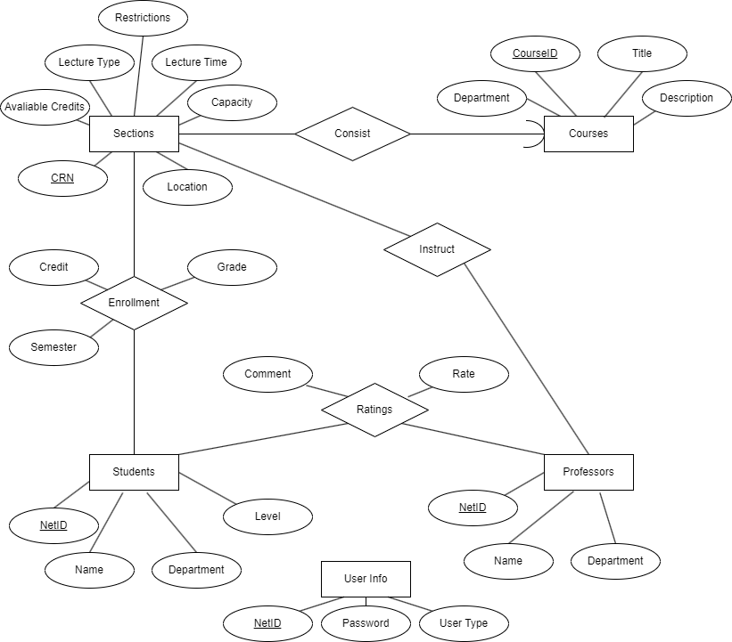

# Database conceptual design

## ER diagram



## Entities

There are a total of five entities for our database design. Each is explained in detail as follows.

### 1. User Info

This is an entity regarding user login information, with three attributes.

1. NetId: a unique identifier to distinguish between users. This should be a string attribute and primary key for this table. NetId will serve as the username for login page.
2. Password: a string attribute, password for login the platform.
3. UserType: a enumerate attribute with values `Student` or `Professor`. This is to identify whether the user is a student or professor.

This entity is designed according to the assumptions:
1. Every user in this platform will have a unique NetId and cannot be modified, regradless of their identity (student or professor).
2. Users can change their password, which is the only allowed update operation for this entity table. We do not support new users to register. 
3. Once the user entered the NetId and password, the system will automatically identify the type of the user (student or professor), and lead the user to the corresponding menu. We suppose that one person can only be either a student or a professor.

### 2. Students

This is an entity for information of students. There are four attributes:

1. NetId: a string attribute to uniquely identify a student as the primary key.
2. Name: a string attribute to identify student's name.
3. Department: a string attribute to identify their department.
4. Level: an enumarate attribute with values `Grad` and `Undergrad`, to identify the degree level of their program.

Here we make the following assumptions:
1. A student is either a graduate or an undergraduate student. This field is to check their eligibility for registering.
2. Here we do not set the foreign key constraints for attribute `NetId` referencing `UserInfo`. One reason is that we need a stronger constraint to also check whether the `UserType` is `Student`. We will use assertion for the constraint. Another reason is that since we do not allow user to register, the cardinality of the table is constant. Once all the information is imported, we will no longer allow any update in this table. 

### 3. Professors

The entity is similar to the `Student`, with similar attributes and assumptions. We have the following attributes for the entity:
1. NetId: a string attribute to uniquely identify a professor as the primary key.
2. Name: a string attribute to identify professor's name.
3. Department: a string attribute to identify their department.

Since we have the similar assumptions. We will treat `NetId` here the same way as in `Students`.

### 4. Courses

The entity is for course information and have the following attributes:

1. CourseId: a string attribute to uniquely identify a course (as primary key). The string here follows the format `<department> + <number>`, such as `CS411`. 
2. Department: a string attribute to identify the department for the course. 
3. Title: a string attribute for the name of the course. 
4. Description: a long string attribute for the description of the course.

Here we assume that a course can only be owned by one department. In real situations, a course may have different course id in different department (e.g. `CS450` is also `ECE491`). We regard these two as **different** courses, since they aim at different students and may have different requirements, although they may be instructed by the same instructor, and give lectures together.

### 5. Sections

Section is the class that are arranged for a specific course. A section of the course will have its own instructors, lecture time and location and capacity. It has the following attributes:

1. CRN (Course reference number): a integer value to uniquely identify a course section (as primary key).
2. LectureType: a string value to identify how the lectures are given. (e.g. `In-person Lecture`, `Lecture&Discussion`, `Online lecture`, etc.)
3. AvaliableCredits: a string value to identify the avaliable credits for the section. This is for students to select how many credits they want for their enrollments. We use a formatted string to represent a set of intergers, split with "`,`" (e.g. `3,4` means 3 or 4 credits avaliable).
4. Restrictions: a string value to identify the restrictions for registering this section. This is mainly for sections only for undergrads or only for graduates. (e.g. `None` means no restrictions, `U` means undergrads not allowed to register, `G` means graduates not allowed to register, `UG` means both undergrad or graduates are not allowed to register, thought not likely to appear)
5. LectureTime: a string value to identify the lecture time for the section. The string follows the format of `<DAY><TIME_START><TIME_END>` and separated by "`,`" (e.g. `MON15301645,WED15301645` means lectures will be given on Monday and Wedesday at 3:30 to 4:45pm).
6. Capacity: a integer to show the max capacity for this section. This will be served as a eligibility check for enrollments.
7. Location: a string attribute to identify the location of the lecture.

One section belongs to a course. However, `Sections` here is not a weak entity because `CRN` itself is enough to uniquely identify a section. We will use relation `Consist` (shown below) to show the relation between courses and sections.

There are a few other assumptions:
1. Lectures will have a fixed schedule every week. There is no arrangement for a section to have lectures on Monday for one week and Tuesday for another. I believe the UIUC course system follows this as well.
2. There will be no restrictions regarding section attributes other than the capacity and level restrictions. We do not have restrictions that are not mentioned in the attributes, such as prerequisits. 


```mysql
#Entities

CREATE TABLE UserInfo(
    NetId VARCHAR(255),
    Password VARCHAR(255),
    UserType ENUM('Student', 'Professor'),
    PRIMARY KEY(NetId)
);

CREATE TABLE Students(
    NetId VARCHAR(255),
    Name VARCHAR(255),
    Department VARCHAR(255),
    Level ENUM('Grad', 'Undergrad'),
    PRIMARY KEY(NetId)
);

CREATE TABLE Professors(
    NetId VARCHAR(255),
    Name VARCHAR(255),
    Department VARCHAR(255),
    PRIMARY KEY(NetId)
);

CREATE TABLE Courses(
    CourseId VARCHAR(255),
    Department VARCHAR(255),
    Title VARCHAR(255),
    Description VARCHAR(5000),
    PRIMARY KEY(CourseId)
);

CREATE TABLE Sections(
    CRN int,
    LectureType VARCHAR(255),
    AvaliableCredits VARCHAR(255),
    Restrictions VARCHAR(255),
    LectureTime VARCHAR(255),
    Capacity int,
    Location VARCHAR(255),
    CourseId VARCHAR(255),
    PRIMARY KEY(CRN),
    FOREIGN KEY(CourseId) REFERENCES Courses(CourseId) ON DELETE CASCADE
);


#Relationships
CREATE TABLE Instruct(
    Professor VARCHAR(255),
    CRN int references Sections(CRN) ON DELETE CASCADE,
    PRIMARY KEY(Professor, CRN),
    FOREIGN KEY(Professor) REFERENCES Professors(NetId) ON DELETE CASCADE,
    FOREIGN KEY(CRN) REFERENCES Sections(CRN) ON DELETE CASCADE
);

CREATE TABLE Ratings(
    Student VARCHAR(255),
    Professor VARCHAR(255),
    Rate REAL,
    Comment VARCHAR(5000),
    PRIMARY KEY(Student, Professor),
    FOREIGN KEY(Student) REFERENCES Students(NetId) ON DELETE CASCADE,
    FOREIGN KEY(Professor) REFERENCES Professors(NetId) ON DELETE CASCADE
);

CREATE TABLE Enrollments(
    CRN int,
    NetId VARCHAR(255),
    Semester VARCHAR(255),
    Credit VarChar(255),
    Grade VARCHAR(255),
    PRIMARY KEY(NetId, CRN),
    FOREIGN KEY(CRN) REFERENCES Sections(CRN) ON DELETE CASCADE,
    FOREIGN KEY(NetId) REFERENCES Students(NetId) ON DELETE CASCADE
);


```