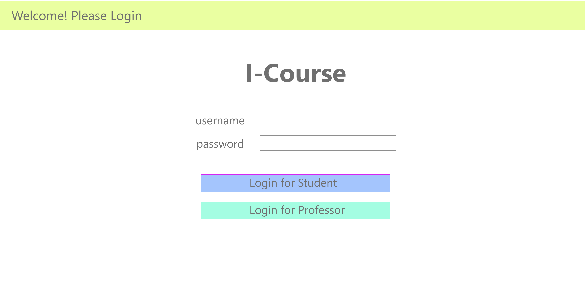
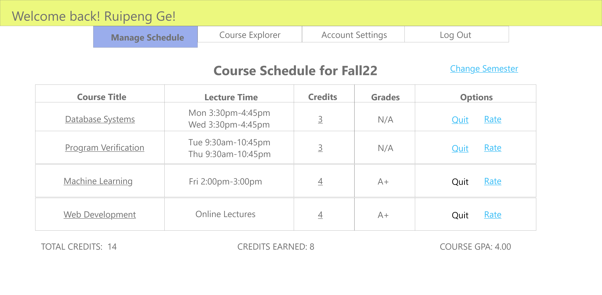
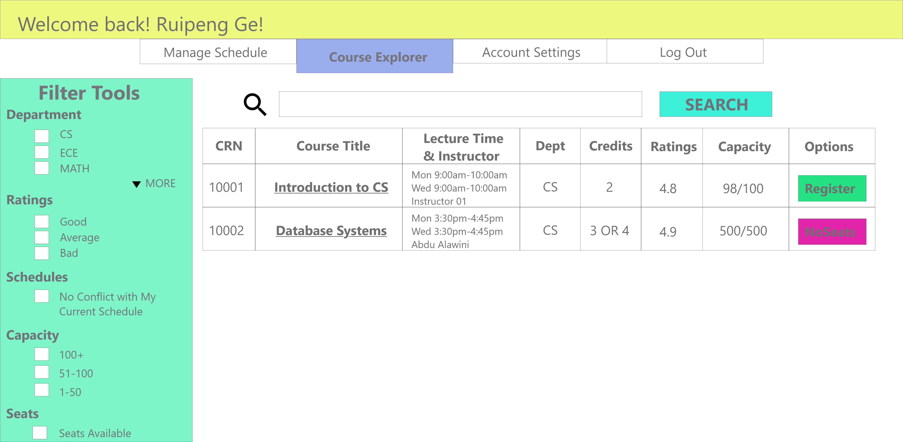
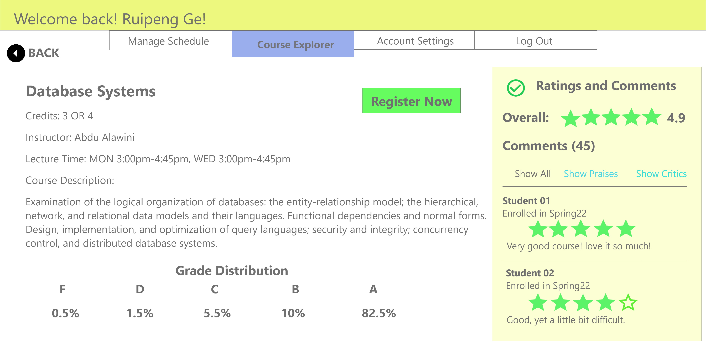

# I-Course Platform
> Project Proposal

## Project Summary

I-Course Platform is a comprehensive system which combines the functionality of Course Explorer, Self-Service systems, Course Rating systems and Academic Performance Tracking systems. We aim to create a web application that allows students to manage their course schedule and professors to manage the course offerings they teach.

Both students and instructors need a simple and efficient way to manage courses. For students, a robust system is needed to make sure they can get into courses without any unnecessary stress. For instructors, they need to be able to easily manage a large number of class offerings they may teach in a semester. Our project aims to provide a solution to both issues: a simple and intuitive way for both students and teachers to access their courses. 

## Description

By storing information of students, professors, course information and enrollment schedules into databases, we allow both students and professors to easily manage their courses all in one place. This will help them track their schedule in a simple way, and save time registering and managing courses during enrollment period, then solve the problem that students may mess up their courses when they have multiple courses and professors may be not able to differentiate different sections of the same course they teach.

Our project aims for two types of users: students and professors. For students, we allow them to track and manage their semester course schedules and grades, rate their courses and leave comments, and also search for detailed information of their favorite courses and make easy registrations, just like walking inside a supermarket and picking up goods they want! For professors, they can manage courses they instruct, give grades to students, and also see comments for their instructions.

## Usefulness

This system is highly practical, since we aim to develop similar functionality to UIUC’s Self-Service system. Students and professors could migrate to our platform and find the same functionality they expect from the existing system built right into our web application. 

However, our application is more than just mimicking the Self-Service system. We are here to bring convenience to the users and enhance their experiences. Students no longer need to visit Course Explorer to see course details, and go back to Self-Service to enter CRN for registration. They can make advanced searches once filtering by department, lecture time, ratings, etc., and enroll in the course by simply one click.

Our project is practical and tackles the need for an efficient course registration service. The current system set in place by the university seems antiquated, so we are hoping to develop something that is more modern and user friendly. Hopefully, it can serve as a proof-of-concept of a system that can be adopted by the university. 

## Realness

We will collect course data from UIUC Course Explorer, and create data for professors according to the instructors in the course information. Student’s information and initial enrollment status can be randomly generated.

We will try to ensure the authenticity of the data by using as much data as we can from the website of UIUC Course Explore. If we can’t determine the exact data, we will search it on other websites of UIUC and try to make it exact.

## Functionality

There are basically two roles: Students and Professors. Each role will have different functions and UI displays and interfaces. Users will need to specify a role when they sign in.

We plan to create a database with four tables which contain the following information:

1. **Students**: store personal information of students
    1. **StudentNo** INT: Primary Key to identify students.
    2. **UserName** VARCHAR(30): Similar to NetID, the username for students to log in. This attribute should be distinct.
    3. **Password** VARCHAR(30): Password for students to log in.
    4. **FirstName** VARCHAR(255): First name of student.
    5. **LastName** VARCHAR(255): Last name of student.
    6. **Department** VARCHAR(100): Department of student.
   
2. **Professors**: store personal information of professors
    1. **ProfNo** INT: Primary Key to identify professors.
    2. **UserName** VARCHAR(30): Similar to NetID, the username for professors to log in. This attribute should be distinct.
    3. **Password** VARCHAR(30): Password for students to log in.
    4. **FirstName** VARCHAR(255): First name of student.
    5. **LastName** VARCHAR(255): Last name of student.
    6. **Department** VARCHAR(100): Department of student.
3. **Courses**: store all course information provided for a certain semester
    1. **CRN** INT: Primary Key to identify courses.
    2. **Title** VARCHAR(255): Title of the Course.
    3. **Department** VARCHAR(100): Department in which the course belongs.
    4. **InstructorNo** INT: Instructor of the course. Reference to Professors(ProfNo).
    5. **AvailableCredit** VARCHAR(255): Use string to identify available credit students can enroll in. e.g. ‘3|4’ stands for both 3 or 4 credits.
    6. **Capacity** INT: Max capacity of the course.
    7. **LectureType** VARCHAR(255): Lecture type of the course.
    8. **LecutreTime** VARCHAR(255): Use string to identify lecture time of the course. e.g. ‘MON15301645|WED15301645’ means there are lectures from 3:30pm to 4:45pm on Monday and Wednesday. 
    9. **Description** VARCHAR(9999): Brief description of the course.
4. **Enrollments**: store all the enrollment information of students
    1. **StudentNo** INT: Referring to Students(StudentNo).
    2. **CRN** INT: Referring to Courses(CRN).
    3. **Credits** INT: Credits for students’ enrollment for this course.
    4. **Grade** REAL: Student’s Grade for this course.
    5. **Rate** REAL: Student’s Rating for this course.
    6. **Semester** VARCHAR(20): semester for the enrollment.
    7. **Comments** VARCHAR(9999): Student’s comment for this course.

For the role Students, we plan to implement the following functionalities:
1. **Log in**: Allow Students to log in. Check the input with attributes in table Students.
2. **Change username/passwords**: Allow Students to modify their username/password. Done by updating table Students.
3. **View Semester Schedule**: Allow Students to view their course schedule for this semester. They can also view grades and their GPA this semester. Done by queries on table Enrollments.
4. **Search for courses**: Allow Students to search for courses using various filter conditions. Students can type a course name to search for the course, or use filter tools to identify the department, credit, time, etc. Course lists will display in the format of lists. Students can click on a course to view details. They can also directly enroll in that course if they are eligible. Done by queries on table Courses.
5. **Make changes to schedule**: Allow Students to enroll in new courses, drop existing courses, or change credit for a course. Done by updating table Enrollments.
6. **Rate the courses**: Allow Students to rate the course and write comments which can be viewed by other students and professors.

For the role Professors, we plan to implement the following functionalities:
1. **Log in**: Similar as students.
2. **Change username/passwords**: Similar to students.
3. **View Instruction Schedule**: Allow professors to view courses they instruct this semester. They can also view the students list for a certain course, and the ratings and comments from students. Done by queries on table Enrollments.
4. **Change status of courses**: Allow professors to change descriptions, or maybe expand capacity for this course.
5. **Add a new course**: Add a new course instructed by the professor.
6. **Give Grade to students**: Give grades for all enrolled students.

Creative Functionality:

Time permitting, we also plan to improve the system as a whole to make it a more convenient and real course management platform. For instance,
1. Automatically check eligibility for enrollments: when a student requests an enrollment of the course, we automatically check the eligibility of the operation, including max credit constraints, schedule conflicts, etc. We will also try our best to ensure the robustness of our system by putting constraints and checking eligibility whenever an update or delete is about to execute.
2. Favorite Courses: Students can save their favorite course for later registration. This would always happen when we want to register for a course without available space currently. We can also alert students for available space when they log in. This would result in defining a new table in the database.
3. Admin Account: Admins are superusers who can make significant changes to the database. For example, they can close registration or dropping functionality to prevent further changes of course schedules of students, or make insertion or deletion for students and professors (We do not allow students or professors to sign up for new accounts in this system).

## Low Fidelity UI Mockup

Here are some UI designs for Student Users. UI for Professors are similar.

> Login Page

> Student Schedule Management

> Course Explorer

> Detailed Course Information

## Work Distribution

Our tentative work distribution is as follows:

**Ruipeng Ge**:

UI design, functionality design, basic functions query implementation

**Lumeng Xu**:

Website frontend, database relation creation (student, professor, course, …), creative functionality

	
**Feiya Yu**:

Website backend, QA/testing, basic functions query implementation

**Alvin Zhang**:

Database design, find existing database (course data), creative functionality

