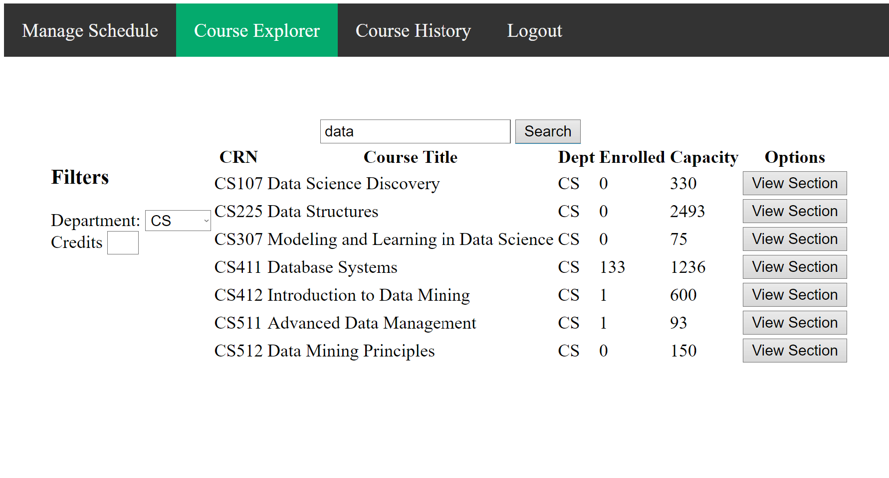

**Team Name:** iloveCS411 (Team 013) 
**Project Title:** iCourse
 
### Changes from the Proposal
Throughout the lifecycle of our project, we have not deviated from the original project proposal much. We spent a lot of time thinking through the database schema, necessary functionality, and other features to ensure that we would have a solid plan to work off of. As a result, there have been no changes to the database schema, the source of our data, and overall project direction. 
We didn’t make any major changes to our ER diagram and table implementation. The initial database design accommodated all our needs for this project.
 
Unfortunately, we have had to remove some features that were originally in our proposal. The ability for a user to reset their password on the login page was something that we ended up not implementing, since we prioritized other core features. We also did not have time to implement a fully-fledged commenting system for courses like we had hoped to originally, and underestimated the effort it would have taken to create it. These things could be things that improve the usability and practicality of our project.
 
Another area that ended up deviating from the proposal was the UI design. For example, the page for searching up courses was designed to look like this:

 
Instead, it looks like this: 

 
### Improvements
On the topic of things to improve– we have come up with a few ideas that could potentially be useful for users: 
Integrate IDP services for login, which would allow users to use their school credentials to access the system
For the course explorer, it could be useful to have more filtering conditions, as well as filters for grade distributions
Another feature that would be useful is to display a map to users showing where their classes are located, which would help users account for walking distance
A useful improvement to the explorer functionality would be to automatically filter out sections that conflict with a user’s existing schedule
If we were to develop a schedule on which features to work on first, we would target the automatic filtering of courses that can’t fit into a student’ schedule. This is a current grievance with the current course explorer, as even though it shows sections as “Time Conflict”, they are still populating a lot of the search results. 
 
### Challenges
Here is a list of comments from each team member discussing technical challenges they encountered throughout this project: 
 
Ruipeng Ge: A big challenge was to use flask, since it is different from other frameworks. 

Lumeng Xu: The biggest difficulty I met was how to calculate the average GPA of a student. Because the code is a combination of python and SQL, I need to first select the grade in character and then change it to corresponding GPAs. And I was not very familiar with it.
 
Feiya Yu: The biggest difficulty I faced was to pick up the skills of web development again. It was challenging because we had to develope the entire website in such a short period of time, because we didn’t start building the App earlier.
 
Alvin Zhang: One thing that was difficult was making the search results for courses dynamic (the table of classes changes depending on what keyword is entered and what is fetched from the database). This involved some Javascript code to insert components and remove them (grabbing an element, then adding to its innerHTML), which I was unfamiliar with in the beginning. 
 
 
 
### Teamwork
The work was split up depending on each member’s strengths and interests. Ahead of any project deadlines, the topics to be completed were always made known to everyone and distributed. Communication was done over WeChat, and it was where updates were given on project progress. Below is a list showcasing things that each member worked on: 
Ruipeng Ge: Database functionality, Professor’s homepage for managing sections and grades, Student’s course history
 
Lumeng Xu: Database functionality(Credits change and course updates for students, calculation of credits and GPAs).
 
Feiya Yu: Worked on login and student homepage. Front-end development for these, and also Flask endpoints for login, drop courses, getting a student’s registered courses. 
 
Alvin Zhang: Worked on the course explorer page that shows course offerings and sections for those courses. Also added capability for students to enroll in sections. Did the frontend development for this, as well as the flask endpoints necessary. 
 
### Results
Overall, our application has managed to implement the basic functionality we had hoped for it to do, such as searching for courses and sections, managing a student’s schedule, adding/dropping courses, and changing credits for a course. Professors are also able to manage many sections at a time, and change section capacity as well as student grades in one area, which should hopefully make managing courses simpler. Regretfully, we were not able to implement the commenting system for sections, which could enhance the user experience and make our system more useful.
 
The advanced database programs that we have definitely make iCourse better. First, it should be able to achieve the functionality that students or professors are able to change their passwords. Then, if we have a large enough database, we can try to show the average GPA for specific sections for every course in addition to  the brief description of the course when searching for a course.The trigger we have where, if a professor changes the max capacity to a number less than the current number of enrolled students could be quite useful. It would allow professors to quickly cap/stop enrollments in a section.  Additionally, the transaction management we have in place handles cases where two users could be registering for the same section at the same time, which reduces the occurrences of errors. 
