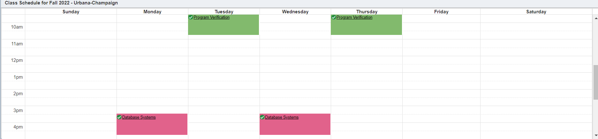

# I-Course App Design

> Ruipeng Ge 10/30/2022

This is a detailed Design of the Website App in a relatively high level. Mainly for reference of implementation.

Page Management:

- [Login Page](#page-1-login-page-homepage)

  - [Student Homepage](#page-2-student-homepage)
    - [Magage Schedule](#page-3-manage-schedule)
    - [Course Explore](#page-4-course-explorer)
      - [Course Detail](#page-5-course-detail)
    - [Account Settings](#page-6-account-settingsstudentsprofessors)
  - [Professor Homepage](#page-7-professor-homepage)
    - [Instruction Schedule](#page-8-instruction-schedule-management)
    - [Account Settings](#page-6-account-settingsstudentsprofessors)

## Page 1: Login Page (Homepage)

### Function 1: User login

**Description**: User login and lead them to the user page.

**Interface**: Input `NetId` and `Password`, hit `Login` button.

**Pseudo-code**: 
```
userType, password = SELECT Usertype, Password FROM UserInfo WHERE NetId = input_NetId
if no data was fetched:
    warning("Invalid NetId")
else if password != input_Password:
    warning("Invalid Password")
else:
    lead to homepage of userType
```

## Page 2: Student Homepage

### Function 2: Homepage Menu(Student)

**Description**: Set a menu bar to direct to different pages.

**Interface**: A menu bar with `Manage Schedule`, `Course Explorer`, `Account Settings`, `Logout`. Direct User to Different Pages.

### Function 3*: Schedule Display

**Description**: Display current semester schedule *in weekly schedule view*.

**Interface**: Display weekly schedule in homepage, shown as below.



**Pseudo-code**: 

```
schedule = SELECT * FROM Enrollment WHERE NetId=user_NetId AND Semester=current_sem
change schedule to a weekly schedule view
display schedule
```

> Assume the current semester is `FA22`

## Page 3: Manage Schedule

### Function 4: Show Course Schedule by Semester

**description**: Display course schedule given a specific semester. Display Course Name, Lecture Type, Time, Location, Credit, Grade

**interface**: Show a list of semesters that user can click on to change to different one. The schedule table should make changes accordingly. When user first enter the page, default to display schedule of current semester.

**pseudo-code**:

```
semester = user choice of semester
schedule = 
    SELECT Title, LectureType, LectureTime, Location, Credit, Grade
    FROM Enrollments NATURAL JOIN Sections NATURAL JOIN Courses
    WHERE NetId=... AND Semester=...
display schedule
```

> For the semester list, we can use a fixed list or a dynamica list according to the Enrollment records (can use aggregation functions to search all semesters with enrollment records).

### Function 5: Calculate GPA and Credits

**description**: Calculate `semester GPA`, `overall GPA`, `Credits Enrolled this semester`, `Credits Earned this semester`, `Credits Earned totally`

**interface**: When choosing different semesters, calculate and display those values below/above the schedule table.

> Credits Earned: Sum of all credits in Enrollments records whose Grade is determined and not `F`.
> 
> GPA Calculation: Ignore all courses without a determined letter grade.
> 
> May need to think about a way to deal with Re-takes

### Function 6: Manage Course(Quit/Change Credit)

**description:** For those courses whose grades are not determined, allow user to quit(drop) the course, or change credits.


**interface**: display two buttons, or allow click on the "Credit" column to do changes. Buttons should be inactive once Grade is determined.

> Just a deletion or update to the "Enrollments" table.

### Function 7: Rate Professor

**description**: Allow user to rate the professor of the sections they take. 

**interface**: Create a button for rating. Usually a window appears which allows users to choose a rating and leave comments. Once rating submitted, a tuple is added to `Rating` table.

## Page 4: Course Explorer

### Function 8: Keyword Search

### Function 9: Filter Tools

### Function 10: Enroll in Courses

### Function 11: View Course Details

## Page 5: Course Detail

> Also Provide Interface of [FC7](#function-7-rate-professor), [FC10](#function-10-enroll-in-courses)

### Function 12: Display Course Details

### Function 13: Calculate Course Grade Distribution

### Function 14: Show Professor Ratings

## Page 6*: Account Settings(Students&Professors)

### Function 15*: Change Password

## Page 7: Professor Homepage

### Function 16: Homepage Menu(Professor)

### Function 17: Instruction Sections Display

## Page 8: Instruction Schedule Management

### Function 18: Display All Students for the section

### Function 19: Change Capacity/Description

### Function 20: Give/Modify Grades
